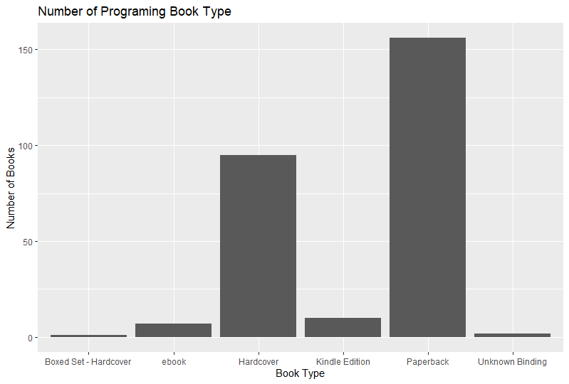
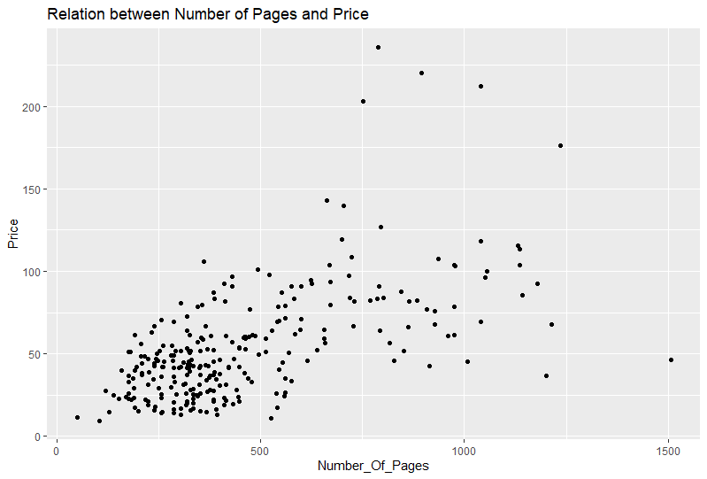

# R-Assignment 4

**Created by Chanunporn Pongsri (ID: 63130500014)**

Choose Dataset:
Top 270 Computer Science / Programing Books (Data from Thomas Konstantin, [Kaggle](https://www.kaggle.com/thomaskonstantin/top-270-rated-computer-science-programing-books)) >> [Using CSV](https://raw.githubusercontent.com/safesit23/INT214-Statistics/main/datasets/prog_book.csv)


### Outlines
1. Explore the dataset
2. Learning about library => tm, wordcloud
3. Transform data with dplyr and finding insight the data
4. Visualization with GGplot2

## Part 1: Explore the dataset

```
#Library
library(dplyr)
library(assertive)
library(readr)
library(stringr)
library(tidyr)
library(ggplot2)

library(purrr) ##new tidyverse library
# purrr -> Use for enhances R’s functional programming ex. map() functions etc.

# Dataset
prog_book <- read_csv("https://raw.githubusercontent.com/safesit23/INT214-Statistics/main/datasets/prog_book.csv")
View(prog_book)
glimpse(prog_book)
```

In this dataset has .....
Rows: 271
Columns: 7
```
$ Rating          <dbl> 4.17, 4.01, 3.33, 3.97, 4.06, 3.84, 4.09, 4.15, 3.~
$ Reviews         <dbl> 3829, 1406, 0, 1658, 1325, 117, 5938, 1817, 2093, ~
$ Book_title      <chr> "The Elements of Style", "The Information: A Histo~
$ Description     <chr> "This style manual offers practical advice on impr~
$ Number_Of_Pages <dbl> 105, 527, 50, 393, 305, 288, 256, 368, 259, 128, 3~
$ Type            <chr> "Hardcover", "Hardcover", "Kindle Edition", "Hardc~
$ Price           <dbl> 9.323529, 11.000000, 11.267647, 12.873529, 13.1647~
```

## Part 2: Learning function from lubridate

- Function `map()` from package [purrr](https://purrr.tidyverse.org/reference/map.html)). 
It using for transform their input by applying a function to each element of a list or atomic vector and returning an object of the same length as the input.
```
# Compute normal distributions from an atomic vector
1:2 %>% map(rnorm, n = 2)
```
Result:
```
[[1]]
[1]  1.09729145 -0.04099913

[[2]]
[1] 0.2806366 1.3423211
```

## Part 3: Transform data with dplyr and finding insight the data
### 1. จงหาว่ามีหนังสือเล่มใดบ้างที่มีมีเรตติ้งสูงกว่าค่าเฉลี่ย โดยเรียงลำดับชื่อตามตัวอักษร 
//
```
prog_book %>% filter(Rating > mean(Rating)) %>% select(Book_title) %>% arrange(Book_title)
```
Result:
```
# A tibble: 147 x 1
   Book_title                                                                                           
   <chr>                                                                                                
 1 3D Math Primer for Graphics and Game Development                                                     
 2 A First Course in Logic: An Introduction to Model Theory, Proof Theory, Computability, and Complexity
 3 A Tour of C++                                                                                        
 4 Accelerate: Building and Scaling High-Performing Technology Organizations                            
 5 Accelerated C++: Practical Programming by Example                                                    
 6 Advanced Programming in the UNIX Environment                                                         
 7 Adventures in Minecraft                                                                              
 8 Agile Software Development, Principles, Patterns, and Practices                                      
 9 Algorithm Design                                                                                     
10 Algorithms                                                                                           
# ... with 137 more rows
```
// รายชื่อหนังสือจะแสดงออกมาโดยเรียงลำดับตั้งแต่ที่ชื่อขึ้นต้นด้วยตัวเลขไปจนอักษรตัวสุดท้ายในภาษาอังกฤษเท่าที่ลิสต์หนังสือนี้มี โดยเป็นตามรายชื่อใน Result ด้านบน

### 2. หนังสือประเภท Hardcover มีกี่เล่มที่คนรีวิวมียอดสูงกว่าค่าเฉลี่ย
//
```
prog_book %>% filter(Type == "Hardcover" & Reviews > mean(Reviews)) %>% count()
```
Result:
```
# A tibble: 1 x 1
      n
  <int>
1    22
```
// มีหนังสือประเภท Hardcover ที่มียอดคนรีวิวสูงกว่าค่าเฉลี่ย 22 เล่ม

### 3. มีหนังสือกี่เล่มที่ Book_title มีจำนวนตัวอักษรน้อยกว่า 30 ตัวอักษร
//
```
bookT <- prog_book %>% select(Book_title)
count_title <- data.frame(bookT %>% map(function(x) str_length(x)))
count_title %>% filter(Book_title < 30) %>% count()
```
Result:
```
   n
1 77
```
// มีหนังสือทั้งหมด 77 เล่ม ที่ Book_title มีจำนวนตัวอักษรน้อยกว่า 30 ตัวอักษร

### 4. หนังสือเล่มที่มีจำนวนหน้าน้อยที่สุด และเป็นเล่มที่มีผู้รีวิวต่ำกว่าค่าเฉลี่ย เป็นหนังสือประเภทใด
//
```
prog_book %>% filter(Number_Of_Pages == min(Number_Of_Pages) & Reviews < mean(Reviews)) %>% select(Type)

```
Result:
```
# A tibble: 1 x 1
  Type          
  <chr>         
1 Kindle Edition
```
// หนังสือเล่มที่มีจำนวนหน้าน้อยที่สุด และเป็นเล่มที่มีผู้รีวิวต่ำกว่าค่าเฉลี่ยเป็นหนังสือประเภท Kindle Edition

### 5. หนังสือประเภท Hardcover ที่มีราคาต่ำที่สุด มีราคาต่างจากหนังสือประเภท Paperback ที่ราคาสูงที่สุดอยู่เท่าใด
//
```
Hardcover <- prog_book %>% filter(Type == "Hardcover")
Paperback <- prog_book %>% filter(Type == "Paperback")

lowP_HC <- Hardcover %>% filter(Price == min(Price)) %>% select(Price)
highP_PB <- Paperback %>% filter(Price == max(Price)) %>% select(Price)

lowP_HC-highP_PB
```
Result:
```
      Price
1 -202.7735

#ต่างกัน 202.7735 USD
```
// Hardcover ที่มีราคาต่ำที่สุด มีราคาถูกกว่า Paperback ที่ราคาสูงที่สุด 202.7735 USD

### 6. จงหาค่าเฉลี่ยของเรตติ้ง ของหนังสือที่มีคนรีวิวน้อยกว่า 100 คน
//
```
prog_book %>% select(Rating, Reviews) %>% filter(Reviews < 100) %>% summarise(mean(Rating))
```
Result:
```
# A tibble: 1 x 1
  `mean(Rating)`
           <dbl>
1           4.05
```
// ในบรรดาหนังสือที่มียอดคนรีวิวน้อยกว่า 100 คนนั้น หนังสือเหล่านี้มีค่าเฉลี่ยของเรตติ้งอยู่ที่ 4.05

### 7. จำนวนคนรีวิวที่สูงที่สุด ของหนังสือประเภท Kindle Edition คือเท่าใด และเป็นของหนังสือเล่มใด
//
```
prog_book %>% filter(Type == "Kindle Edition") %>%  filter(Reviews == max(Reviews)) %>% summarise(Book_title, Reviews)
```
Result:
```
# A tibble: 1 x 2
  Book_title       Reviews
  <chr>              <dbl>
1 How Google Works    1325
```
// หนังสือเรื่อง How Google Works (อยู่ในประเภท Kindle Edition) มีจำนวนคนรีวิวที่สูงที่สุด อยู่ที่ 1325 คน


## Part 4: Visualization with GGplot2
### 1.) The number of orders in each region?
```
#Step 1: Save to object
type_plot <- ggplot(prog_book,aes(x=Type)) + geom_bar()
type_plot

#Step 2: Adding component
type_plot + ggtitle("Number of Programing Book Type") +
  xlab("Book Type") + ylab("Number of Books")
```
Result:



### 2.) In which subcategory has the most orders?
```
#Step 1 + 2
prog_book %>% filter(Number_Of_Pages < 3000) %>% ggplot(aes(x=Number_Of_Pages,y=Price))+geom_point() + ggtitle("Relation between Number of Pages and Price")
```
Result:


