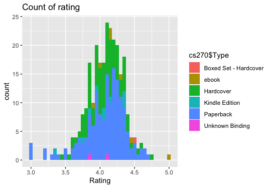
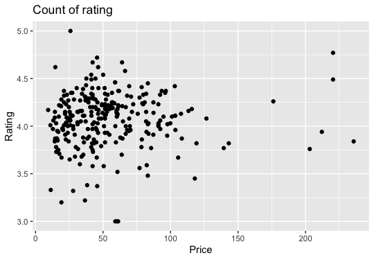

# R-Assignment 4

**Created by Narawich Kampusa (ID: 63130500065)**

Choose Dataset:
1. Top 270 Computer Science / Programing Books (Data from Thomas Konstantin, [Kaggle](https://www.kaggle.com/thomaskonstantin/top-270-rated-computer-science-programing-books)) >> [Using CSV](https://raw.githubusercontent.com/safesit23/INT214-Statistics/main/datasets/prog_book.csv)

### Outlines
1. Explore the dataset
2. Learning function from Tidyverse
3. Transform data with dplyr and finding insight the data
4. Visualization with GGplot2

## Part 1: Explore the dataset

```
# Library
library(dplyr)
library(readr)      
library(ggplot2)

# Dataset
cs270 <- read.csv("https://raw.githubusercontent.com/safesit23/INT214-Statistics/main/datasets/prog_book.csv")
```
มีจำนวน 271 observations และ 7 variables

## Part 2: Learning function from Tidyverse
- Function `str_detect()` from package [stringr](https://www.rdocumentation.org/packages/stringr/versions/1.4.0)) หาว่ามีตัวไหนบ้างที่ตรงกับ Pattern
```
str_detect(x, pattern)
```
** สามารถใส่ dataset และ pattern เพื่อดูว่ามีค่าไหนบ้างที่ตรงกับ pattern ที่ใส่ โดยจะ return เป็น `True, False`

## Part 3: Transform data with dplyr and finding insight the data
### 3.1 หาว่า datatype ไหนไม่เหมาะสม
```
cs270 %>% glimpse()
```
```
Result
Rows: 271
Columns: 7
$ Rating          <dbl> 4.17, 4.01, 3.33, 3.97, 4.06, 3.84, 4.09, 4.15, 3.87, 4.62, 4.03, 3.78, 3.73, 3.87, 3.87…
$ Reviews         <chr> "3,829", "1,406", "0", "1,658", "1,325", "117", "5,938", "1,817", "2,093", "0", "160", "…
$ Book_title      <chr> "The Elements of Style", "The Information: A History, a Theory, a Flood", "Responsive We…
$ Description     <chr> "This style manual offers practical advice on improving writing skills. Throughout, the …
$ Number_Of_Pages <int> 105, 527, 50, 393, 305, 288, 256, 368, 259, 128, 352, 352, 200, 328, 240, 288, 392, 304,…
$ Type            <chr> "Hardcover", "Hardcover", "Kindle Edition", "Hardcover", "Kindle Edition", "Paperback", …
$ Price           <dbl> 9.323529, 11.000000, 11.267647, 12.873529, 13.164706, 14.188235, 14.232353, 14.364706, 1…
```
Reviews ควรจะเป็น Interger

### 3.2 หาค่าเฉลี่ย Rating ของแต่ละประเภทของหนังสือ
```
cs270 %>% group_by(Type) %>% select(Rating) %>% summarise(avg = mean(Rating, na.rm = TRUE)) %>% arrange(desc(avg))
```
```
Result
  Type                    avg
  <chr>                 <dbl>
1 Boxed Set - Hardcover  4.49
2 ebook                  4.29
3 Paperback              4.06
4 Hardcover              4.06
5 Kindle Edition         4.01
6 Unknown Binding        3.99
```

### 3.3 หาหนังสือที่มีราคาสูงสุดและต่ำสุด
```
cs270 %>% group_by(Book_title) %>% select(Price) %>% summarise(max_price = max(Price))%>% arrange(desc(max_price)) %>% head(1)
cs270 %>% group_by(Book_title) %>% select(Price) %>% summarise(min_price = min(Price))%>% arrange((min_price)) %>% head(1)
```
```
Result
> cs270 %>% group_by(Book_title) %>% select(Price) %>% summarise(max_price = max(Price))%>% arrange(desc(max_price)) %>% head(1)
# A tibble: 1 × 2
  Book_title                            max_price
  <chr>                                     <dbl>
1 A Discipline for Software Engineering      236.

> cs270 %>% group_by(Book_title) %>% select(Price) %>% summarise(min_price = min(Price))%>% arrange((min_price)) %>% head(1)
# A tibble: 1 × 2
  Book_title            min_price
  <chr>                     <dbl>
1 The Elements of Style      9.32
```

### 3.4 หาค่า max, min, avg ของ Rating
```
cs270$Rating %>% mean()
cs270$Rating %>% max()
cs270$Rating %>% min()
```
```
Result
> cs270$Rating %>% mean()
[1] 4.067417
> cs270$Rating %>% max()
[1] 5
> cs270$Rating %>% min()
[1] 3
```

### 3.5 หาจำนวนประเภทของหนังสือ
```
cs270 %>% select(Type) %>% table()
```
```
Result
> cs270 %>% select(Type) %>% table()
Boxed Set - Hardcover                 ebook             Hardcover        Kindle Edition             Paperback              Unknown Binding 
                    1                     7                    95                    10                   156                            2 
                    
```

### หาว่ามีหนังสือเล่มไหนที่มีคำว่า `Programming`
```
str_subset(cs270$Book_title, "Programming")
```
```
Result
> str_subset(cs270$Book_title, "Programming")
 [1] "Game Programming Golden Rules"                                                                         
 [2] "Expert C Programming: Deep C Secrets"                                                                  
 [3] "Beginners Guide On PHP Programming: Quick And Easy Guide To Learn PHP With My-SQL"                     
 [4] "Python Programming Books Set: Python Programming for Beginners & Complete Guide for Python Programming"
 [5] "Introduction to Functional Programming"                                                                
 [6] "An Introduction to Functional Programming Through Lambda Calculus"                                     
 [7] "Python Crash Course: A Hands-On, Project-Based Introduction to Programming"                            
 [8] "Python Programming For Beginners: Quick And Easy Guide For Python Programmers"                         
 [9] "Eloquent JavaScript: A Modern Introduction to Programming"                                             
[10] "Learn Java the Easy Way : A Hands-On Introduction to Programming"                                      
[11] "Automate the Boring Stuff with Python: Practical Programming for Total Beginners"                      
[12] "Best of Game Programming Gems"                                                                         
[13] "Functional Programming in Scala"                                                                       
[14] "Programming in Lua, Fourth Edition"                                                                    
[15] "Functional Programming Application and Implementation"                                                 
[16] "Game Programming Patterns"                                                                             
[17] "The Practice of Programming (Addison-Wesley Professional Computing Series)"                            
[18] "From Mathematics to Generic Programming"                                                               
[19] "Elements of Programming"                                                                               
[20] "Programming Pearls"                                                                                    
[21] "Programming Ruby: The Pragmatic Programmers' Guide"                                                    
[22] "The Linux Programming Interface: A Linux and Unix System Programming Handbook"                         
[23] "Extreme Programming Explained: Embrace Change (The XP Series)"                                         
[24] "Introduction to Computation and Programming Using Python"                                              
[25] "The Psychology of Computer Programming"                                                                
[26] "Accelerated C++: Practical Programming by Example"                                                     
[27] "More Exceptional C++: 40 New Engineering Puzzles, Programming Problems, and Solutions"                 
[28] "Exceptional C++ Style: 40 New Engineering Puzzles, Programming Problems, and Solutions"                
[29] "Effective Programming: More Than Writing Code"                                                         
[30] "Exceptional C++: 47 Engineering Puzzles, Programming Problems, and Solutions"                          
[31] "Modern C++ Design: Generic Programming and Design Patterns Applied"                                    
[32] "Beginning Game Programming: A Gamedev.Net Collection"                                                  
[33] "Advanced Game Programming: A Gamedev.Net Collection"                                                   
[34] "Cross-Platform Game Programming (Game Development) (Charles River Media Game Development)"             
[35] "Haskell: The Craft of Functional Programming"                                                          
[36] "Lambda-Calculus, Combinators and Functional Programming"                                               
[37] "Fluent Python: Clear, Concise, and Effective Programming"                                              
[38] "How to Design Programs: An Introduction to Programming and Computing"                                  
[39] "Advanced Programming in the UNIX Environment"                                                          
[40] "Programming PHP"                                                                                       
[41] "The C Programming Language"                                                                            
[42] "The C++ Programming Language"                                                                          
[43] "Mathematics for 3D Game Programming and Computer Graphics"                                             
[44] "The UNIX Programming Environment"                                                                      
[45] "Genetic Programming II: Automatic Discovery of Reusable Programs"                                      
[46] "Practical Foundations for Programming Languages"                                                       
[47] "Game Programming Gems"                                                                                 
[48] "Game Programming Gems 2"                                                                               
[49] "Game Programming Gems 5"                                                                               
[50] "Essentials of Programming Languages"                                                                   
[51] "The Art of Computer Programming, Volume 1: Fundamental Algorithms"                                     
[52] "Concepts, Techniques, and Models of Computer Programming"                                              
[53] "Game Programming Gems 6"                                                                               
[54] "Game Programming Gems 4"                                                                               
[55] "Game Programming Gems 3"                                                                               
[56] "The Art of Computer Programming, Volumes 1-3 Boxed Set"                                                
[57] "The Art of Computer Programming, Volumes 1-4a Boxed Set" 
```

## Part 4: Visualization with GGplot2
### 1.) Graph show Count of Rating
```
ggplot(cs270, aes(Rating, fill = cs270$Type)) + geom_histogram(binwidth = 0.05) + ggtitle("Count of rating")
```
Result:



แสดงจำนวนของแต่ละ Rating

### 2.) Graph show relation between Price and Rating
```
ggplot(cs270 ,aes(Price, Rating)) + geom_point()+  ggtitle("Count of rating")
```
Result:



แสดง relation ระหว่าง rating กับ price
